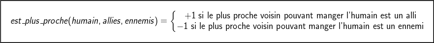

## Rapport projet d'intelligence artificielle 

Ce projet a pour but de créer une Intelligence Artificielle permettant de jouer au jeu "Vampires vs Loup-Garous".

### Table des matières: 
+ **[1. Prérequis](#prerequisites)**
+ **[2. La structure du code](#code_structure)**
+ **[3. Structure de l'IA](#ia_struct)**
  + **[3.1. Représentation d'un état du jeu](#board_representation)**
  + **[3.2. Création d'un nouvel état](#new_representation)**
+ **[4. L'implémentation de l'algorithme AlphaBeta](#alg_implementation)**
  + **[4.1. Le déroulé général](#general_behavior)**
  + **[4.2. La création des alternatives/branches](#branches)**
  + **[4.3. Séparation et rassemblement](#split_merge)**
  + **[4.4. L'heuristique](#heuristic)**
+ **[5. Idées d'amélioration](#next_steps)**

### 1. Prérequis  

Afin de pouvoir lancer l'IA, il vous suffit d'avoir, sur la machine, Java 8.

### 2. La structure du code 

Le code est construit autour de 5 packages:

- **utils :** Ce package n'est composé que d'une seule case, la classe `Utils`, une classe statique fournissant quelques fonctions utilisables par d'autres packages. On y retrouve notamment des fonctions pour calculer le prochain mouvement, supprimer des duplicats, ...
- **tcp :** Ce package contient le client TCP implémenté dans le but de communiquer avec le serveur. Son rôle sera donc de comprendre les trames envoyées par le serveur et d'envoyer des trames compréhensibles par le serveur avec nos mouvements pendant la partie.
- **main :** Ce package contient la classe `Project` qui est lancée par le fichier d'exécution, il s'agit du point d'entrée du programme. Il va écouter en permanence le client et assurer de transmettre les bonnes informations aux classes qui implémentent la logique métier.
- **board :** Ce package donne une représentation en objet du jeu. Il contient donc 4 classes : 
  - `Board`: Cette classe est une représentation du plateau de jeu, et contient la liste des positions de chacune des espèces, ainsi que le contenu de chacune des cellules de la carte.
  - `Position`: Cette classe représente une position sur la carte, et est donc donnée par deux coordonnées x et y.
  - `Player`: Définie par une race, cette classe permet de définir les deux joueurs et de savoir qui est le joueur actif lors du déroulé de l'algorithme AlphaBeta.
  - `Cell`: Cette classe représente le contenu d'une cellule de la carte. Elle est donc définie par une race qui la peuple et par une population.
- **algorithm :** Ce package contient toute l'intelligence de notre programme, l'algorithme qui est exécuté à chacun de nos tours et visant à fournir le meilleur déplacement possible:
  - `Result`: Cette classe est une représentation d'un résultat de mouvement, et se constitue donc d'une position source, d'une destination, et d'un nombre d'unités déplacées.
  - `Node`: La classe `Node` est un noeud de l'arbre créé par l'algorithme AlphaBeta et se constitue donc d'une carte associée, de son heuristique, et également du nombre d'humains mangés par nous et l'adversaire depuis le début de l'algorithme jusqu'à la carte créée.
  - `AlphaBeta`: C'est ici que l'algorithme est déroulé, et cette classe contient la logique et l'heuristique. 

  
### 3. Architecture de l'IA et Représentation de l'environnement 

#### 3.1. Représentation d'un état du jeu 
  

La classe Board permet aussi bien de représenter l'état actuel du plateau de jeu que des états futurs estimés. Pour cela elle garde en mémoire un tableau de toutes les cellules du plateau, celles-ci étant remplies avec le type d'espèce présente et la quantité de population. 

Sont également gardés en mémoire trois liste pour connaitre les positions des humains, des alliés et des ennemis sur la carte. Cela permet ainsi de retrouver rapidement chacun des groupes sans avoir à parcourir toutes les cellules.

Par ailleurs, puisque l'on raisonne entre alliés et ennemis plutôt qu'entre vampires et loups-garous, on garde également en mémoire la race jouée par chacun des joueurs (ainsi que la race à qui c'est le tour de jouer).

#### 3.2. Création d'un nouvel état 

À partir d'un état estimer à un moment de l'algorithme, il convient de pouvoir estimer des états futurs à partir des déplacements effectués. 

La classe Result permet de représenter de déplacement d'une certaine quantité de population d'une case à une autre case adjacente. Ainsi, le coup joué à l'issue d'un tour est déterminé par une liste d'objets Result contenant tous les déplacement effecutés (en veillant bien sûr à ce que tous ces déplacements soient possibles et compatibles).

Déterminer un nouvel état du jeu se fait alors en deux étapes :
- déterminer un ensemble de déplacements que l'on peut envisager (pas nécessairement exhaustif pour éviter une explosion combinatoire);
- créer pour chaque mouvement un nouveau noeud contenant le nouvel état du jeu.

Lorsque l'on génère un nouveau Board, on modifie le contenu des cellules suite au déplacement effectué. On modifie de même la liste des positions de chaque race. Par ailleurs, lorsque l'on génère le noeud contenant ce nouvel état du terrain, on garde également en mémoire la liste des mouvements effectués (pour pouvoir remonter cette information lors de la prise de décision finale) ainsi que le nombre d'humains mangés par chaque camp depuis le noeud initial (pour pouvoir utiliser cette valeur dans l'heuristique).

<!-- 3.3. Branches -->
  
### 4. L'implémentation de l'algorithme AlphaBeta 

#### 4.1. Le déroulé général 

A chacun de notre tour, le programme réagit de la manière suivante:

1. A chaque tour, on récupère la trame d'update de la carte et on appelle alors la méthode `fillOrUpdate` de `Board` **(Board L. 64)**. Cette méthode est appelée au début de la partie pour créer toute la carte mais également à chaque tour afin de garder la carte dans la même état que le serveur.
2. Une fois la carte mise à jour, on va envoyer nos mouvements. Pour ce faire, la classe `Board` va instantier une instance de `AlphaBeta` avec comme racine de l'arbre la carte courante, avant notre tour de jeu. **(Board, L. 317)**
3. On va alors appeler la méthode `algorithm` de `AlphaBeta` à une profondeur 3. **(Board L. 323)**
4. Des appels récursifs seront faits afin de diminuer la profondeur et donc descendre dans l'arbre jusqu'à la profondeur voulue. L'heuristique étant calculée lorsque le noeud est terminal (partie terminée) ou que la profondeur maximale est atteinte.
5. Cette fonction va simplement appeler `AlphaBeta` et retourner l'attribut de classe `bestMoves`, représentant les mouvements à envoyer au serveur. **(AlphaBeta L. 24)**

#### 4.2. La création des alternatives/branches 

C'est dans l'exécution de l'algorithme `AlphaBeta` qu'on créé l'arbre des différentes alternatives (avec la méthode `createAlternatives` **(AlphaBeta L. 42)**). Le schéma est le suivant: pour chaque stratégie, nous allons récupèrer les meilleurs mouvements à réaliser avec la méthode `findBestMovesForStrategy`**(Node, L. 386)**. Cette méthode permet, à partir d'une position et d'une stratégie, de renvoyer un nombre limite de choix que l'on considère comme les meilleurs. Cela nous permet de limiter le nombre de branches et d'être un peu plus intelligent qu'un glouton, qui étudierait les cases adjacentes à la position. Pour se faire nous étudions 4 stratégies:

- L'attaque : Il s'agit ici de retourner le groupe présentant le meilleur ratio nombre d'ennemis / distance pour y arriver, sous reserve que l'on gagne à coup sûr la bataille (c'est à dire que nous ne nous intéressons qu'aux groupes d'ennemis dont 1,5 * leur nombre est plus petit que la position que nous étudions). Dans le cas où aucun groupe ne serait trouvé mais qu'il ne nous reste qu'un seul groupe et pas d'humains, nous attaquons le groupe le plus faible (c'est la stratégie de jouer le tout pour le tout parce que nous avons perdu si nous ne faisons rien).
- La transformation : Ici, nous allons retourner les deux groupes d'humains, dont la population est inférieure ou égale au nombre d'éléments sur la position étudiée, présentant le meilleur ratio nombre d'humains / distance pour y arriver.
- La fuite : Pour calculer la meilleure position de fuite, nous allons simplement maximiser la somme des distances vis-à-vis des adversaires pour chacune des cases adjacentes à la position étudiée.
- L'unification : On va ici retourner la position du plus proche groupe le plus grand de nous vers lequel on pourrait aller pour se réunir.

Il faut noter ici que les stratégies de réunification et de fuite ne sont étudiées que si l'attaque et la transformation ne renvoient aucun résultat. Ceci permet d'élaguer naturellement l'arbre en début de partie. Une fois que l'on a récupérée cette liste de destinations potentielles, on regarde, pour la transformation, s'il n'est pas possible de se séparer **(Node, L. 180)**. La décision de se séparer ou non sera détaillée dans la partie suivante.

Maintenant que l'on a nos voeux d'actions, il faut transcrire cela en des combinaisons de mouvements de nos unités ou des unités adversaires. Ceci est le but de la fonction `computeAllMoves` **(Node L. 350)**. Cela va permettre de créer toutes les combinaisons possibles de mouvements d'unités, en prenant en compte tous les ordres, et tous les mouvements différents. Cette technique, couteuse en terme de calcul, a le mérite de faire comme si on regardait l'influence des mouvements de chaque unité sur les autres et on prenait la meilleure combinaison de mouvement. Nous enlevons cependant les combinaisons de mouvements dont deux destinations sont égales, cela permet d'enlever les mouvements de troupes qui veulent atteindre le même point. Nous enlevons également les mouvements circulaires, qui ne sont pas de vrais mouvements mais simplement des échanges de troupes entre positions adjacentes. Cependant, ces mouvements restent encore vers des cibles, et ce ne sont pas donc pas encore de vrais mouvements sur des cases adjacentes. On passe donc ensuite sur ces combinaisons pour trouver le meilleur mouvement à faire pour aller d'une source vers une cible. C'est le but de la fonction `findBestMove` du package utils. Ces combinaisons de mouvements sont ensuite utilisées pour créer des noeuds enfants, après avoir créé une nouvelle carte avec ces mouvements.

Il est à noter que pour l'adversaire, nous n'étudions que l'attaque et la transformation sans séparation. Cela serait trop couteux pour notre IA de considérer tous ces choix en plus.

#### 4.3. Séparation et rassemblement 

Dans certains scénarios, il peut être utile de séparer les alliés en plusieurs groupes. Les groupes d'alliés ainsi formés doivent respecter certains critères : ils doivent ainsi tous avoir une taille leur permettant de gagner au moins un combat sur la carte. Concrètement, cette condition signifique que chaque groupe d'alliés formé doit comprendre au moins min(Nombre minimum d'humain, 1,5 * Nombre minimum d'ennemis) alliés.

#### 4.4. L'heuristique 

Le calcul de l'heuristique est fait de manière globale: cela veut dire que l'on va évaluer l'état d'une carte, avec nos positions, celles de l'ennemis ainsi que les humains. L'idée ici n'est pas de calculer un score pour chaque déplacement et de sommer le tout. Ici, le but est de prendre en compte les positions des alliés entre eux, avec tous les mouvements possibles, afin d'être le plus fidèle possible à ce qui pourrait se passer. Le calcul de l'heuristique repose sur la formule suivante:

<figure>
  

    
     Fig1. - Formule utilisée pour évaluer une carte.
  

</figure>

**Calcul de la fonction d'évaluation des humains:**

Si on se concentre maintenant sur le calcul de la fonction d'évaluation des humains, on la représente de la manière suivante:

<figure>
  

    
     Fig2. - Formule utilisée pour évaluer les humains sur une carte.
  

</figure>

Avec dans cette équation, `est_plus_proche`, définie par : 

<figure>
  

    
     Fig3. - Décomposition de la fonction est_plus_proche
  

</figure>

Ainsi, en pratique, le raisonnement est le suivant: pour chaque groupe d'humains, on va chercher l'ennemi le plus proche dont la population dépasse la population d'humains sur la case. On fait la même chose pour les alliés. Si la distance minimum est celle de l'ennemi, ou que les distances sont égales mais que c'est à nous de jouer, alors on ajoute la valeur du ratio . Dans le cas contraire, le ratio est retiré du score. **(AlphaBeta L. 88 - L. 115)**

**Calcul de la fonction d'évaluation des opposants:**

Intéressons nous désormais à la fonction d'évaluation des opposants sur la carte. Elle se décompose sous la forme suivante

<figure>
  

    
     Fig4. - Formule utilisée pour évaluer les ennemis sur une carte.
  

</figure>

Où la fonction `score` est déterminée de la manière suivante:

<figure>
  

    
     Fig5. - Score entre un allié et son plus proche opposant
  

</figure>

Ici, le raisonnement est implicite à la formule : pour chaque allié, on va trouver l'ennemi le plus proche, et calculer le score en fonction des populations de chacun des deux groupes **(AlphaBeta L. 117 - L. 141)**.

### 5. Idées d'amélioration 

Afin d'améliorer notre IA, nous aurions également pu: 
- Entrainer plusieurs algorithmes (AlphaBeta, SSS...) pour déterminer le plus efficace sur un nombre représentatif de parties
- Mieux choisir les branches étudiées lors de l'execution de l'algorithme AlphaBeta
- Augmenter la profondeur de l'arbre pour évaluer plus de coups de l'adversaire et mieux comparer les différents scénarios possibles
